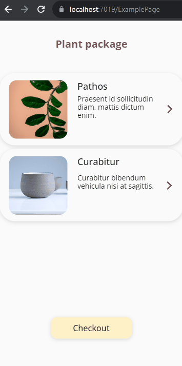

# UseBackButton
UseBackButton gives you full control over how the "Back" button behaves within your single page activities of your Blazor app. Use it to make a UI back button, the browser back button, and native OS “back” gestures (Blazor Hybrid app), all result in the same behavior.




## Usage

### Creating the Required Functions

Declare a  `Func<Task>` to bind to UseBackButton's `OnClickHandler` and define function to handle back button navigation.

```csharp
@code {
    // UseBackButton will set this function
    protected Func<Task> BackButtonClickHandler { get; set; } = null!;
	
    // function to handle back button event
    private bool OnBack()
    {
        // Return false if the page navigation should proceed as normal
        // else 
        // do component navigation and return true. 
    }
}
```


### Adding the UseBackButton to Your Page or Component and Binding the Required Functions

```html
<UseBackButton OnBack="OnBack" @bind-OnClickHandler="BackButtonClickHandler" />
```


### Binding the OnClickHandler to a Button

```html
<button type="button" @onclick="BackButtonClickHandler"></button>
```

